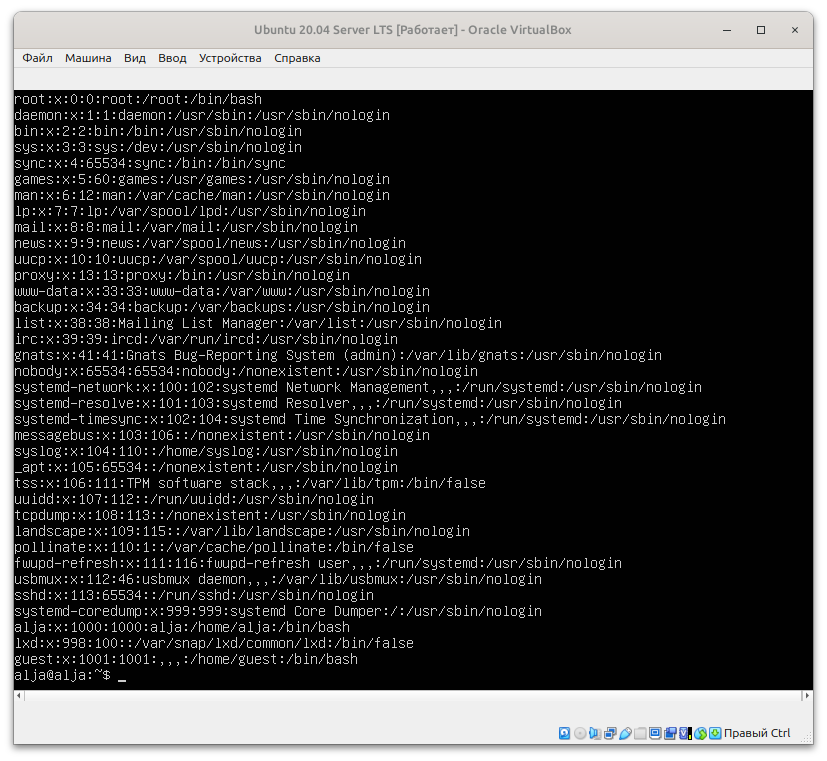
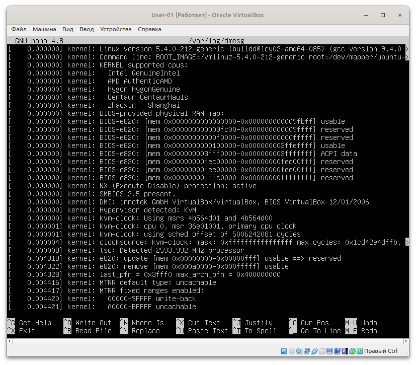

# Отчет по установке и настройке Ubuntu 20.04.2 Server LTS
Операционные системы UNIX/Linux (Базовый).

## Навигация
- [Part 1. Установка ОС](#part-1-установка-ос)
- [Part 2. Создание пользователя](#part-2-создание-пользователя)
- [Part 3. Настройка сети ОС](#part-3-настройка-сети-ос)
- [Part 4. Обновление ОС](#part-4-обновление-ос)
- [Part 5. Использование команды sudo](#part-5-использование-команды-sudo)
- [Part 6. Установка и настройка службы времени](#part-6-установка-и-настройка-службы-времени)
- [Part 7. Установка и использование текстовых редакторов](#part-7-установка-и-использование-текстовых-редакторов)
- [Part 8. Установка и базовая настройка сервиса SSHD](#part-8-установка-и-базовая-настройка-сервиса-SSHD)
- [Part 9. Использование утилиты fdisk](#part-9-использование-утилиты-fdisk)
- [Part 10. Использование утилиты df](#part-10-использование-утилиты-df)
- [Part 11. Использование утилиты du](#part-11-использование-утилиты-du)
- [Part 12. Установка и использование утилиты ncdu](#part-12-установка-и-использование-утилиты-ncdu)
- [Part 13. Работа с системными журналами](#part-13-работа-с-системными-журналами)
- [Part 14. Использование планировщика заданий CRON](#part-14-использование-планировщика-заданий-cron)
- [Part 15. Использование планировщика заданий CRON](#part-15-использование-планировщика-заданий-cron)

## Part 1. Установка ОС
На виртуальную машину установлена Ubuntu 20.04.2 Server LTS  


Версия Ubuntu в терминале:  
```bash
cat /etc/issue
```


## Part 2. Создание пользователя

Создаем нового пользователя guest:
```bash
sudo adduser guest
```


Добавляем нового пользователя guest в группу adm с помощью команды:
```bash
sudo usermod -a -G adm guest
```



Проверяем, есть ли новый пользователь в файле passwd:
```bash
cat /etc/passwd
```


## Part 3. Настройка сети ОС

Название машины изменено:


Чтобы узнать какая временная зона установлена:
```bash
timedatectl
```
Вывожу названия сетевых интерфейсов:
```bash
ifconfig
```

> Интерфейс lo, или "loopback" — это виртуальный сетевой интерфейс, который доступен только внутри ОС (локально):
    • lo позволяет программам на одном компьютере взаимодействовать друг с другом через IP-адрес 127.0.0.1. Т.е. любые данные, отправленные на этот адрес, не покидают машину и сразу же возвращаются обратно. Lo не доступен из вне.
    • Интерфейс lo обычно автоматически настраивается при загрузке системы. Он всегда активен и работает, даже если другие сетевые интерфейсы отключены.
    • часто используется для тестирования сетевых приложений. Можно запускать серверные приложения и взаимодействовать с ними, не выходя за пределы своей системы.


Чтобы узнать ip, выданный DHCP сервером:
```bash
cat /var/log/syslog | grep -i dhcp
```
> DHCP (Dynamic Host Configuration Protocol) — сетевой протокол, позволяющий устройствам автоматически получать IP-адрес для доступа в сеть. Он автоматически назначает IP-адреса и другие необходимые сетевые параметры устройствам в сети, что позволяет быстро и безошибочно подключаться к локальной сети или интернету.
Основное назначение DHCP - в автоматизации процесса настройки сетевых параметров устройств в сети. Это избавляет от необходимости вручную присваивать каждому устройству уникальный IP-адрес и другие параметры:
>- упрощает управление сетью, особенно при большом количестве устройств. DHCP позволяет автоматически назначать IP-адреса и другие сетевые параметры (например, маску подсети, шлюз по умолчанию, DNS-серверы) устройствам в сети. Это значительно упрощает процесс настройки сети.  Сокращает вероятность ошибок при ручной настройке.
>- DHCP использует концепцию аренды IP-адресов, что означает, что адресы могут быть временно назначены устройствам на определенный период времени. После истечения срока аренды адрес может быть возвращен в пул и назначен другому устройству

Внешний ip-адрес шлюза: отправляем запрос к серверу ifconfig.co:
```bash
curl ifconfig.co
```
получаем ответ: публичный IP-адрес


внутренний IP-адрес шлюза, он же ip-адрес по умолчанию (gw):
```bash
ip route
```


Записываем статичные (заданные вручную) настройки ip, gw, dns (публичный DNS-серверы, 1.1.1.1 или 8.8.8.8):
```bash
sudo nano /etc/netplan/01-network-manager-all.yaml
network:
  version: 2
  renderer: networkd
  ethernets:
    enp0s3:                
      dhcp4: no
      addresses:
        - 192.168.1.100/24   
      gateway4: 192.168.1.1  
      nameservers:
          addresses: [1.1.1.1, 8.8.8.8] 
```
сохраняем. 
```bash
sudo netplan apply
```


Перезапускаем машину ```bash sudo reboot``` и проверяем dns:
```bash
cat /etc/resolv.conf 
```
не выводит установленные addresses: [1.1.1.1, 8.8.8.8] 
Проверяем dns запись по другому:
```bash
cat /run/systemd/resolve/resolv.conf
```
DNS-серверы указаны.
Тогда создаём символическую ссылку (симлинк) между двумя файлами: 
```bash
sudo ln -sf /run/systemd/resolve/resolv.conf /etc/resolv.conf
```
>* ln — это команда для создания ссылок в Unix-подобных системах. Она позволяет создавать жёсткие или символические ссылки на файлы и каталоги.
>* s — флаг, указывающий на создание символической ссылки. Символическая ссылка — это файл, который ссылается на другой файл или директорию, позволяя обращаться к исходному объекту через эту ссылку.
>* f — флаг, означающий принудительное удаление существующей ссылки, если она уже существует, и замена её новой ссылкой.
>* /run/systemd/resolve/resolv.conf — это путь к файлу конфигурации DNS, управляемого демоном systemd-resolved. Этот файл содержит актуальные настройки DNS-серверов, используемые системой.
>* /etc/resolv.conf — это традиционный файл конфигурации DNS, который используется многими программами для разрешения доменных имён. Он содержит список DNS-серверов, используемых для преобразования доменных имён в IP-адреса.
>* Когда выполняется эта команда, создаётся символическая ссылка, которая направляет файл /etc/resolv.conf на /run/systemd/resolve/resolv.conf. Таким образом, любые изменения в /run/systemd/resolve/resolv.conf (например, изменение DNS-серверов через systemd-resolve) будут автоматически отражаться в /etc/resolv.conf.

Проверяем dns: 
```bash
systemd-resolve --status
```
теперь все ок:


проверяем ip:


пропингем удаленные хосты 1.1.1.1 и ya.ru:


## Part 4. Обновление ОС
```bash
sudo apt update
sudo apt upgrade
```


## Part 5. Использование команды sudo

> Команда ```sudo``` повышает привелегии пользователя до суперпользователя ```root``` (максимальные права). 

Разрешаем sudo пользователю ```guest``` и открываем файл ```sudoers```:
```bash 
sudo visudo
```
> ```visudo``` проверяет синтаксис перед сохранением

Добавление пользователя ```guest``` в открывшемся файле:
```bash
guest ALL=(ALL) ALL
```
далее жмем ```ctrl+s```, ```ctrl+x```

проверяем ```sudo``` у пользователя ```guest``` и меняем текущего пользователя на ```guest```:
```bash
su - guest
```
вводим пароль

тестируем от имени ```gust```:
```bash
sudo ls /root
```
вводим пароль и видим ответ: snap. Работает.


Меняем имя хоста от имени пользователя ```guest```:
проверяем текущее имя хоста:
```bash
hostname
```
текущее имя: alja
```bash
sudo nano /etc/hostname
```
меняем alja на alja01
```ctrl+s```, ```ctrl+x```

перезагружаем систему:
```bash
sudo reboot
```

проверяем текущее имя хоста:
```bash
hostname
```


## Part 6. Установка и настройка службы времени

Выводим настройки часового пояса:
```bash
timedatectl show
```
вывод команды ```timedatectl show``` содержит ```NTPSynchronized=yes```


## Part 7. Установка и использование текстовых редакторов

проверяем, установлен ли редактор **vim**:
```bash
which vim
```
> Если **vim** установлен, команда вернет путь к исполняемому файлу: ```/usr/bin/vim```


проверяем, установлен ли редактор **nano**:
```bash
which nano
```
> Если **vim** установлен, команда вернет путь к исполняемому файлу: ```/usr/bin/nano```


проверяем, установлен ли редактор **mcedit**:
```bash
which mcedit
```
> ничего не вернулось, значит, **mcedit** не установлен


проверяем, установлен ли редактор **joe**:
```bash
which joe
```
> ничего не вернулось, значит, **joe** не установлен


Устанавливаем **mcedit**:
```bash
sudo apt update
sudo apt install mcedit
```

Устанавливаем **joe**:
```bash
sudo apt update
sudo apt install joe
```


создаем файл с помощью **vim**:
```bash
vim test_vim.txt
```
Для редактированя жмем ```i```, затем печатаем свой ник и жмем ```ctrl + c ```
закрывается режим вставки. Далее для сохранения и выхода жмем ```:wq```


создаем файл с помощью **mcedit**:
```bash
mcedit test_mcedit.txt
```
печатаем свой ник и для сохранения жмем ```f2```, выбираем ```сохранить```. Для выхода из редактора жмем ```f10```


создаем файл с помощью **joe**:
```bash
joe test_joe.txt
```
печатаем свой ник. Для выхода из режима редактирования жмем ```ctrl + k```. А для выхода с сохранением изменений жмем ```q```, затем ```y```.


открываем файл с помощью **vim**:
```bash
vim test_vim.txt
```
Для редактированя жмем ```i```, печатаем *21 School 21* и ```ctrl + c``` - закрывается режим вставки. Далее для выхода без сохранения жмем ```:q!```


открываем файл с помощью **mcedit**:
```bash
mcedit test_mcedit.txt
```
печатаем *21 School 21*. Далее для выхода из редактора жмем ```f10``` и выбираем ```нет```.


открываем файл с помощью **joe**:
```bash
joe test_joe.txt
```
печатаем *21 School 21*. Для выхода из режима редактирования жмем ```ctrl + k```. А для выхода без сохранения изменений жмем ```q```, затем ```n```.


открываем файл с помощью **vim**:
```bash
vim test_vim.txt
```
вводим */* и печатаем искомое слово (часть слова)


для замены слова вводим *:%s/старое_слово/новое_слово*


открываем файл с помощью **mcedit**:
```bash
mcedit test_mcedit.txt
```
для поиска жмем ```f7```, вводим искомое слово, выбираем ```найти```


для замены слова жмем ```f4```, вводим текст для замены. Выбираем ```Дальше``` и выбираем ```Заменить```.


открываем файл с помощью **joe**:
```bash
joe test_joe.txt
```
для выхода из режима редактирования жмем ```ctrl + k```, для поиска жмем ```ctrl + kf```, вводим искомое слово, затем, выбираем параметр (например поиск без регистра) - ```i``` и жмем ```enter```


для поиска жмем ```ctrl + kf```, вводим искомое слово, жмем ```r``` и ```enter```.Затем, подтверждаем замену ```y```.


## Part 8. Установка и базовая настройка сервиса SSHD

Обновиляем список пакетов:
```bash
sudo apt update
sudo apt upgrade
```

Проверяю статус службы:
```bash
sudo systemctl status ssh
```
Ответ: не найдена. 

Тогда устанавливаю **OpenSSH** сервер:
```bash
sudo apt install openssh-server
```

Проверяем статус службы:
```bash
sudo systemctl status ssh
```


Настраиваю автоматический запуск **ssh** при загрузке:
```bash
sudo systemctl enable ssh
```

Показываем наличие процесса **sshd** с помощью команды ```ps```:
```bash
ps aux | grep sshd
```


> **ps** - это основная команда для отображения процессов.<br>
aux - эти ключи указывают, какую информацию показывать и в каком формате.<br>
> **a** - показывает процессы, запущенные всеми пользователями, не только текущим. Это позволяет увидеть процессы, которые могут быть запущены другими пользователями.<br>
> **u** - выводит информацию о процессах в более удобном для чтения формате, включая имя пользователя, использующий процесс, и использование ресурсов (CPU и память).<br>
> **x** - показывает процессы, которые не привязаны к терминалу. Это полезно для отображения фоновых процессов, таких как sshd.<br>
> **|** - это оператор, который передает вывод одной команды в качестве ввода для другой команды. В данном случае вывод команды ps aux передается в команду grep.<br>
> **grep sshd** - это команда для поиска строки с текстом sshd в выводе предыдущей команды. Она фильтрует результаты, показывая только те строки, которые содержат sshd.

> Расшифровка вывода:
**root** - имя пользователя, запустившего процесс.<br>
**711** - идентификатор процесса (PID).<br>
**0.0** - процент использования CPU.<br>
**0.5** - процент использования памяти.<br>
**/usr/sbin/sshd -D** - команда, запустившая процесс.<br>
**?** - это терминал (TTY), к которому привязан процесс. Символ ? указывает на то, что процесс не привязан к какому-либо терминалу. Это часто бывает с фоновыми процессами или демонами, такими как sshd, которые работают в фоновом режиме и не требуют взаимодействия с пользователем через терминал.<br>
**Ss** - это статус процесса. Он состоит из двух символов:
**S** - указывает, что процесс находится в спящем режиме.
**s** - указывает, что процесс является лидером сессии. Лидер сессии — это процесс, который управляет группой процессов и связан с терминалом.


Для перенастройки службы **SSHd** на порт **2022**:
```bash
sudo nano /etc/ssh/sshd_config
```
Пишем **port 2022** и сохраняем изменения: ```ctrl + s```, ```ctrl + x```


/media/alja/EXTERNAL_USB/school/основа/do_linux/1/D01_Linux.ID_356272-1/src/img/part-8-status-ssh.png


перезагружаем службу **ssh**:
```bash
sudo systemctl restart ssh 
```

Проверяем статус **ssh**:
```bash
sudo systemctl status ssh
```


Настроим брандмаузер, так как SSH-порт изменили на 2022:
```bash
sudo ufw allow 2022/tcp
```


Проверяем, что процесс **ssh** запущен:
```bash
ps aux | grep -i ssh
```

> **ps** - команда для просмотра процессов.<br>
**a** - показывает процессы, запущенные всеми пользователями, не только текущим. Это позволяет увидеть процессы, которые могут быть запущены другими пользователями.<br>
**u** - Выводит информацию о процессах в более удобном для чтения формате, включая имя пользователя, использующий процесс, и использование ресурсов (CPU и память).<br>
**x** - Показывает процессы, которые не привязаны к терминалу. Это полезно для отображения фоновых процессов, таких как sshd.<br>
**|** - перенаправляет вывод команды ps aux на ввод grep -i ssh.<br>
**grep -i ssh** - находит и выводит только те строки, где есть ssh с игнорированием регистра (```-i```).

Перезагружаем:
```bash
sudo reboot
```

Проверяем порт:
```bash
netstat -tan
```


> Команда netstat позволяет получать подробную информацию о сетевых соединениях, таблицах маршрутизации и состоянии сетевых интерфейсов.<br> 
t - показывает только те соединения, которые используют протокол TCP.<br>
a - показывает все соединения и порты, включая те, которые находятся в состоянии "LISTEN" (ожидающие подключения) и "ESTABLISHED" (установленные соединения). Без этого флага увидим только активные соединения.<br>
n - выводит адреса и номера портов в числовом формате, а не в виде имен хостов и сервисов. 
tan - просмотр всех открытых ТСР-протоколов.<br>
<br>
При вызове команды в терминал выводится таблица, столбцы которой имеют следующие значения:<br>
**Proto** - протокол (например, TCP).<br>
**Recv-Q** - количество байтов, ожидающих на приём.<br>
**Send-Q** - количество байтов, ожидающих на отправку.<br>
**Local Address** - локальный адрес и порт, на котором слушает процесс.<br>
**Foreign Address** - удалённый адрес и порт, с которым установлено соединение (или *, если это слушающее соединение).<br>
**State** - состояние соединения (например, LISTEN или ESTABLISHED).<br>
<br>
Если в столбце "Foreign Address" указано значение 0.0.0.0: *, это может означать, что соединение ещё не установлено или что служба ожидает входящих соединений. В случае активного соединения увидим IP-адрес и порт. Т.е. устройство подключено к удалённому хосту.

## Part 9. Установка и использование утилит top, htop

Утилита ```top``` используется для мониторинга работы системы в реальном времени:
* uptime: 23 мин;
* количество авторизованных пользователей: 1;
* среднюю загрузку системы;
* общее количество процессов: 92;
* загрузку cpu: 0;
* загрузку памяти: 143,1 и 238;
* pid процесса занимающего больше всего памяти: 1;
* pid процесса, занимающего больше всего процессорного времени: 1069.


Утилита ```htop``` тоже выводит данные мониторинга системы, но интерактивна и в другом виде:


* данные отсортированы по PID (f6 и выбор PID):


* данные отсортированы по PERCENT_CPU:


* данные отсортированы по PERCENT_MEM:


* данные отсортированы по TIME:


* отфильтровано для процесса sshd (f4 и вводим нужное слово):


* процесс syslog, найденный с помощью поиска (f3 и вводим нужное слово, для следующего найденного значения тоже f3):


* добавленный вывод hostname, clock и uptime (f2 и выбираем нужные параметры. Для сохранения f10):


## Part 10. Использование утилиты fdisk

```fdisk -l``` требует права супрпользователя, поэтому:
```bash
sudo fdisk -l
```

* Название жесткого диска: VBOX HARDDISK;
* Размер диска: 10.63 ГБ;
* Количество секторов: 22262064.


Узнаем размер подкачки (swap):
```bash
free -h
```

Размер swap: 1,6 ГБ.


## Part 11. Использование утилиты df

```df``` используется для отображения информации о доступном и занятом пространстве на файловых системах:

* корневой раздел (/);
* размер раздела: 9041244;
* размер занятого пространства: 4805892;
* размер свободного пространства: 3754484;
* процент использования: 57%;
* единицы измерения при выводе: Килобайты.


```bash
df -Th
```
Для корневого раздела (/):
* размер раздела: 8,7 ГБ;
* размер занятого пространства: 4,6 ГБ;
* размер свободного пространства: 3,6 ГБ;
* процент использования: 57%;
* единицы измерения при выводе: Гигабайты;
* тип файловой системы: ext4


## Part 12. Использование утилиты du

```du``` - команда для оценки использования дискового пространства.


размер папок ```/home```, ```/var``` в байтах, в человекочитаемом виде:
```bash
du -hs /var
```
> **s** - выводит только общий размер;<br>
**h** - выводит размер в единицах измерения удобных для человека.


размер ```/var/log``` в байтах, в человекочитаемом виде:
```bash
du -hs /var/log
```


## Part 13. Установка и использование утилиты ncdu

Уставливаем ```ncdu```:
sudo apt install ncdu


выводим размер папки ```/home``` с помощью утилиты ```ncdu```:
ncdu /home


выводим размер папки ```/var```:


выводим размер папки ```/var/log```:


Размеры папок примерно совпадают с полученными в Part 12.

## Part 14. Работа с системными журналами

```/var/log/dmesg``` содержит сообщения ядра Linux, которые генерируются во время загрузки системы и в процессе работы. Эти сообщения могут включать информацию:
* о подключенных устройствах (процессоры, оперативная память, диски, сетевые интерфейсы и др.).
* о процессе инициализации системы, включая драйверы, которые загружаются, и устройства, которые распознаются.
об ошибках, связанных с аппаратным обеспечением или драйверами.
* о событиях, происходящих в системе, таких как изменения состояния устройств (например, подключение или отключение USB-устройств).

Чтобы просмотреть журнал, можно воспользоваться командой:
```bash
nano /var/log/dmesg
```


```/var/log/syslog``` глобальный журнал, который содержит системные сообщения и логи, например:
* Сообщения о запуске и остановке служб, загрузке модулей ядра и других системных процессов.
* Информация о проблемах, возникающих в работе приложений и служб.
* Сообщения от различных программ и служб.
* Журналы входа в систему, попытки доступа и другие события, связанные с безопасностью.
* Сообщения о состоянии системы, включая использование ресурсов, загрузку процессора и память.

Чтобы просмотреть журнал, можно воспользоваться командой:
```bash
nano /var/log/syslog
```


Файл ```/var/log/auth.log``` содержит записи, связанные с аутентификацией и авторизацией пользователей. Помогает отслеживать события, касающиеся безопасности и доступа к системе:
* Попытки входа в систему: Успешные и неуспешные попытки входа пользователей, включая имя пользователя и IP-адрес, с которого была осуществлена попытка входа.
* Изменения паролей: Записи о смене паролей пользователями и администратором.
* Использование sudo: Логи команд, выполненных с использованием sudo, включая информацию о том, кто и когда использовал привилегированные команды.
* События, связанные с SSH: Сообщения о подключениях и отключениях по протоколу SSH, включая информацию о неудачных попытках подключения.
* Доступ к системным ресурсам: Записи о доступе к различным системным ресурсам и службам, требующим аутентификации.


Данные из журнала о входе в систему:
* время последней успешной авторизации: 01.04 12:17;
* имя пользователя: alja01;
* метод входа в систему: uid=0.

Перезапускаем службу SSHd:
```bash
sudo systemctl restart ssh
```
открываем auth.log:
```bash
less /var/log/auth.log
```


## Part 15. Использование планировщика заданий CRON

Запускаем команду ```uptime``` через каждые 2 минуты. Для этого, открываем планировщик заданий **CRON**:
```bash
crontab -e
```
выбираем текстовый редактор ```nano```, добавляем новую строку: ```*/2 * * * * uptime``` и
выходим из редактора ```ctrl + x```. Подтверждаем изменения в файле ```y```.


> Расшифровка задания cron:<br> */2 — это первое поле (минуты). Оно означает, что задача будет выполняться каждые 2 минуты. <br> * — второе поле (часы) "каждый час". <br> * — третье поле (дни месяца) "каждый день месяца". <br> * — четвертое поле (месяцы) "каждый месяц". <br> * — пятое поле (дни недели) "каждый день недели". <br> **uptime** выводит информацию о времени работы системы, количестве пользователей и средней загрузке за последние 1, 5 и 15 минут. Команда uptime будет выполняться каждые 2 минуты, и результат выполнения будет записываться в стандартный вывод. Можно указать файл и тогда инфо будет записываться в указанный файл.


Находим в системных журналах инфо о выполнении ```uptime```:
```bash
less /var/log/syslog | grep -i cron
```


Выводим на экран список текущих заданий для **CRON**:
```bash
crontab -l
```


Удаляем все задания из **CRON**:
```bash
crontab -r
```
Проверяем список текщих задач **CRON** после удаления:
```bash
crontab -l
```


-------------------
**D01_Linux == done :)**
