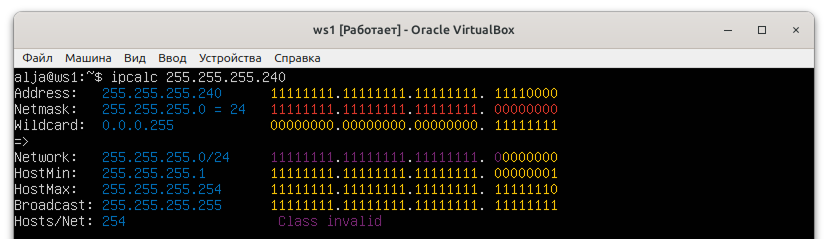
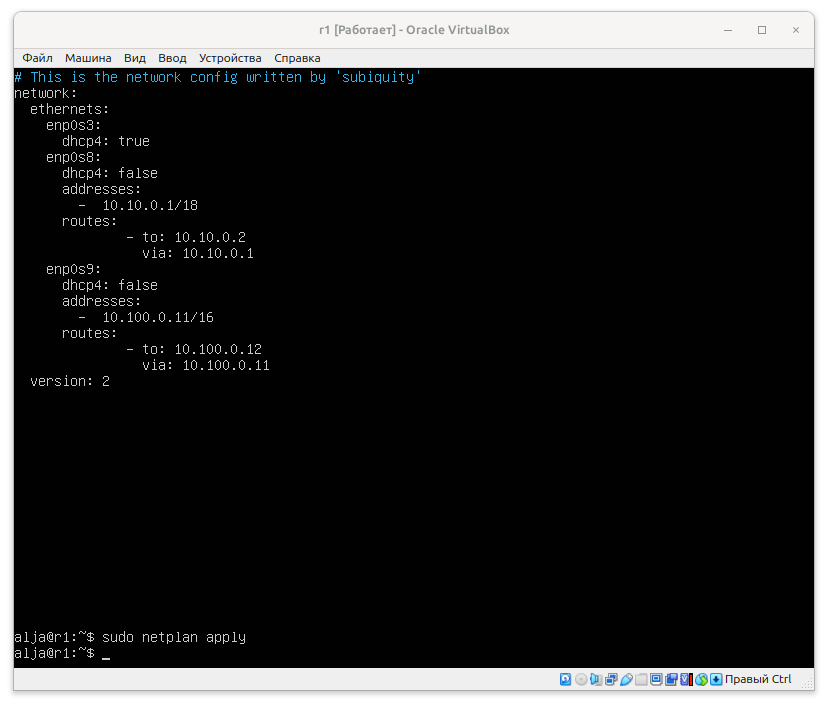
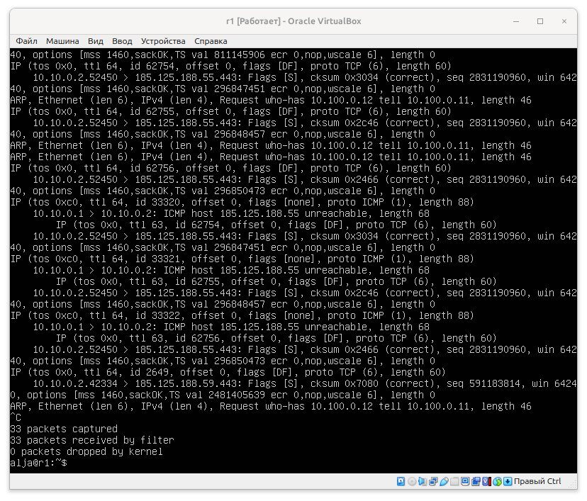
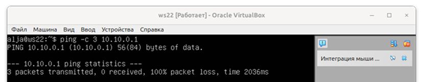

# Отчет по сетям в Linux
Настройка сетей в Linux на виртуальных машинах.

## Навигация

1. [Part 1. Инструмент ipcalc](#part-1-инструмент-ipcalc)<br>
   [1.1. Сети и маски](#сети-и-маски)<br>
   [1.2. localhost](#localhost)<br>
   [1.3. Диапазоны и сегменты сетей](#диапазоны-и-сегменты-сетей)<br>
2. [Part 2. Статическая маршрутизация между двумя машинами](#part-2-статическая-маршрутизация-между-двумя-машинами)<br>
   [2.1. Добавление статического маршрута вручную](#добавление-статического-маршрута-вручную)<br>
   [2.2. Добавление статического маршрута с сохранением](#добавление-статического-маршрута-с-сохранением)<br>
3. [Part 3. Утилита iperf3](#part-3-утилита-iperf3)<br>
   [3.1. Скорость соединения](#скорость-соединения)<br>
   [3.2. Утилита iperf3](#утилита-iperf3)<br>
4. [Part 4. Сетевой экран](#part-4-сетевой-экран)<br>
   [4.1. Утилита iptables](#утилита-iptables)<br>
   [4.2. Утилита nmap](#утилита-nmap)<br>
5. [Part 5. Статическая маршрутизация сети](#part-5-статическая-маршрутизация-сети)<br>
   [5.1. Настройка адресов машин](#настройка-адресов-машин)<br>
   [5.2. Включение переадресации IP-адресов](#включение-переадресации-ip-адресов)<br>
   [5.3. Установка маршрута по умолчанию](#установка-маршрута-по-умолчанию)<br>
   [5.4. Добавление статических маршрутов](#добавление-статических-маршрутов)<br>
   [5.5. Построение списка маршрутизаторов](#построение-списка-маршрутизаторов)<br>
   [5.6. Использование протокола ICMP при маршрутизации](#использование-протокола-icmp-при-маршрутизации)<br>
6. [Part 6. Динамическая настройка IP с помощью DHCP](#part-6-динамическая-настройка-ip-с-помощью-dhcp)<br>
7. [Part 7. NAT](#part-7-nat)<br>
8. [Part 8. Дополнительно. Знакомство с SSH Tunnels](#part-8-дополнительно-знакомство-с-ssh-tunnels)<br>

## Part 1. Инструмент ipcalc
Подняла виртуальную машину (далее -- ws1):


*виртуальная машина ws1 работает*.

Узнала, какая установлена ОС:
```bash
$ cat /etc/issue
```


*результат команды проверки версии ОС*

### Сети и маски
Определила:
1. Адрес сети 192.167.38.54/13:

   у меня **ipcalc** не установлен, поэтому сначала:
   ```bash
    $ sudo apt install ipcalc
   ```

   теперь, когда **ipcalc** установлен, определяю адрес сети: 
   ```bash
    $ ipcalc 192.167.38.54/13
   ```
  

  *установила ipcalc и определила адрес сети*

2. Перевела маски 255.255.255.0 в префиксную и двоичную запись командой:
   ```bash
    $ ipcalc 255.255.255.0
   ```   
  

  *результат команды для перевода маски 255.255.255.0 в префиксную и двоичную записи*

  +  теперь /15 в обычную и двоичную:
     ```bash
      $ ipcalc /15
     ```   
  

  *результат команды для перевода /15 в обычную и двоичную записи*

  + 11111111.11111111.11111111.11110000 в обычную и префиксную:
    ```bash
      $ ipcalc 255.255.255.240
    ```   
    

    *результат команды для перевода 255.255.255.240 в обычную и префиксную записи*

3. Минимальный и максимальный хост в сети 12.167.38.4 при масках: 
  + /8 командой:
    ```bash
      $ ipcalc 12.167.38.4/8
    ``` 
    

    *Минимальный хост: 12.0.0.1.*<br>
    *Максимальный хост: 12.255.255.254*

  + 11111111.11111111.00000000.00000000 ввожу:
    ```bash
      $ ipcalc 12.167.38.4/255.255.255.0
    ```   
    

    *Минимальный хост: 12.0.0.1.*<br>
    *Максимальный хост: 12.255.255.254*

  + 255.255.254.0:
    ```bash
      $ ipcalc 12.167.38.4/255.255.254.0
    ```   
    

    *Минимальный хост: 12.167.38.1.*<br>
    *Максимальный хост: 12.167.39.254*

  + /4:
    ```bash
      $ ipcalc 12.167.38.4/4
    ```   
    

    *Минимальный хост: 0.0.0.1.*<br>
    *Максимальный хост: 15.255.255.254*

### localhost
Определила, можно ли обратиться к приложению, работающему на localhost, со следующими IP: 
+ для проверки 194.34.23.100, ввожу команду:
   ```bash
    $ ping -c 1 194.34.23.100
   ```   
  

  *результат: потеря 100% пакетов, не достучалась:(*

+ для проверки 127.0.0.2, ввожу команду:
   ```bash
    $ ping -c 1 127.0.0.2
   ```   
  

  *результат: потеря 0% пакетов, достучалась:)*

+ для проверки 127.1.0.1, ввожу команду:
   ```bash
    $ ping -c 127.1.0.1
   ```   
  

  *результат: потеря 0% пакетов, достучалась:)*

+ для проверки 128.0.0.1, ввожу команду:
   ```bash
    $ ping -c 128.0.0.1
   ```   
  

  *результат: потеря 100% пакетов, не достучалась:(*

Можно обратиться к 127.0.0.2 и 127.1.0.1. А при обращении к 194.34.23.100 и 128.0.0.1 - 100% пакетов утеряны.

### Диапазоны и сегменты сетей
1. Проверяю с помощью команды ```ipcalc```, какие из перечисленных IP можно использовать в качестве публичного, а какие только в качестве частных: 
   ```bash
    $ ipcalc 10.0.0.45
   ```   
   

   *10.0.0.45 частный (Private Inernet)*

   ```bash
    $ ipcalc 134.43.0.2
   ```   
   

   *134.43.0.2 публичный*

   ```bash
    $ ipcalc 192.168.4.2
   ```   
   

   *192.168.4.2 частный (Private Inernet)*

   ```bash
    $ ipcalc 172.20.250.4
   ```   
   

   *172.20.250.4 частный (Private Inernet)*

   ```bash
    $ ipcalc 172.0.2.1
   ```   
   

   *172.0.2.1 публичный*

   ```bash
    $ ipcalc 192.172.0.1
   ```   
   

   *192.172.0.1 публичный*

   ```bash
    $ ipcalc 172.68.0.2
   ```   
   

   *172.68.0.2 публичный*

   ```bash
    $ ipcalc 172.16.255.255
   ```   
   

   *172.16.255.255 частный (Private Inernet)*

   ```bash
    $ ipcalc 10.10.10.10
   ```   
   

   *10.10.10.10 частный (Private Inernet)*

   ```bash
    $ ipcalc 192.169.168.1
   ```   
   

   *192.169.168.1 публичный*

    В итоге, к частным относятся IP:
    + 10.0.0.45;
    + 192.168.4.2
    + 172.20.250.4
    + 172.16.255.255
    + 10.10.10.10

    А к публичным IP:
    + 134.43.0.2
    + 172.0.2.1
    + 192.172.0.1
    + 172.68.0.2
    + 192.169.168.1

   > Диапазон приватных IP адресов:<br>
   > + 10.0.0.0 до 10.255.255.255;<br>
   > + 172.16.0.0 до 172.31.255.255; <br>
   > + 192.168.0.0 до 192.168.255.255; <br>
   > 
   >Все остальные IP относятся к публичным.

2. Узнаю, какие из перечисленных IP-адресов шлюза возможны у сети 10.10.0.0/18: 10.0.0.1, 10.10.0.2, 10.10.10.10, 10.10.100.1, 10.10.1.255. Воспользуюсь командой:
   ```bash
    $ ipcalc 10.10.0.0/18
   ```   
   

   *Вижу, что 10.0.0.1, 10.10.10.10 и 10.10.100.1 не входят в диапазон адресов сети (HostMin 10.10.0.1 HostMax 10.10.63.254). 10.10.0.2 и 10.10.1.255 входят в диапазон, а значит, возможны для сети 10.10.0.0/18.*


[Наверх к навигации](#навигация)


## Part 2. Статическая маршрутизация между двумя машинами

Подниму две виртуальные машины (далее -- ws1 и ws2).


*виртуальные машины запущены*

Узнаю, какая установлена ОС на ws1:
```bash
$ cat /etc/issue
```


*узнала версию ОС на ws1*

Узнаю, какая установлена ОС на ws2:
```bash
$ cat /etc/issue
```


*узнала версию ОС на ws2*

С помощью команды ```ip a``` смотрю существующие сетевые интерфейсы для ws1 и ws2:


*результат выполнения команды для ws1.*


*результат выполнения команды для ws2.*

Описываю сетевой интерфейс, соответствующий внутренней сети, на обеих машинах и задаю следующие адреса и маски: ws1 — 192.168.100.10, маска /16, ws2 — 172.24.116.8, маска /12.

Начну с ws1. Устанавливаю адрес и маску 192.168.100.10/16, выполнив:
```bash
$ sudo nano /etc/netplan/00-installer-config.yaml
```


*ws1 файл с новыми настройками netplan 00-installer-config.yaml. ip и маска 192.168.100.10/16*

Открывается файл с настройками, прописываю 192.168.100.10/16, сохраняю ```ctrl + s``` и выхожу ```ctrl + x```.
Теперь для перезапуска сервиса сети```netplan``` на машине ws1: 
```bash
$ sudo netplan apply
```


*ws1 перезапустила netplan*

Теперь перейдем к ws2. Точно так же, как и на ws1 Устанавливаю адрес и маску 172.24.116.8/12, выполнив:
```bash
$ sudo mcedit /etc/netplan/00-installer-config.yaml
```
Открывается файл с настройками, прописываю 172.24.116.8/12, сохраняю ```f2``` и выхожу ```f10```.


*ws2 файл с новыми настройками netplan 00-installer-config.yaml. ip и маска 172.24.116.8/12*

Теперь, для перезапуска сервиса сети ```netplan``` на машине ws2: 
```bash
$ sudo netplan apply
```


*ws2 перезапустила netplan*

### Добавление статического маршрута вручную
Добаляю статический маршрут от одной машины до другой и обратно при помощи команды вида ```ip r add```.
Для ws1:
```bash
$ sudo ip r add 172.24.116.8 dev enp0s3
```
Для ws2:
```bash
$ sudo ip r add 192.168.100.10 dev enp0s3
```

пингую соединение между машинами:
+ для ws1:
```bash
$ sudo ping -c 3 172.24.116.8
```


*ws1 пингую ws2: 0% пакетов потеряно*

+ для ws2:
```bash
$ sudo ping -c 3 192.168.100.10
```


*ws1 пингую ws2: 0% пакетов потеряно*


### Добавление статического маршрута с сохранением
перезапускаю машины:
```bash
$ sudo reebot
```

добавляю статический маршрут от одной машины до другой с помощью файла /etc/netplan/00-installer-config.yaml:
```bash
$ sudo mcedit etc/netplan/00-installer-config.yaml
```

Пропингую соединение между машинами.
+ ws1:


*ws1 0% пакетов потеряно*

+ ws2:


*ws2 0% пакетов потеряно*

[Наверх к навигации](#навигация)


## Part 3. Утилита iperf3
### Скорость соединения
Переведу и запишу ниже: 8 Mbps в MB/s, 100 MB/s в Kbps, 1 Gbps в Mbps:

+ 8Mbps = 1MB/s;
+ 100MB/s = 800000 Kbps;
+ 1Gbps = 1000 Mbps.


### Утилита iperf3
Измеряю скорость соединения между ws1 и ws2.

+ ws1:<br>
  Для начала установлю утилиту ```iperf3```:
  ```bash
  $ sudo apt install iperf3 
  ```
  Теперь Запускаю ```iperf3``` в режиме сервера:
    ```bash
  $ iperf3 -s
  ```
  

*ws1 в режиме сервера замер скорости соединения*

+ ws2:
  Так же, как и на ws1 установлю утилиту ```iperf3```:
    ```bash
    $ sudo apt install iperf3 
    ```
  Запускаю ```iperf3``` в режиме клиента, указав IP-адрес сервера (ws1) 192.168.100.10:
    ```bash
    $ iperf3 -c 192.168.100.10 
    ```
  

  *ws2 в режиме клиента замер скорости соединения*

[Наверх к навигации](#навигация)


## Part 4. Сетевой экран
После соединения машин передо мной стоит следующая задача: контролировать информацию, проходящую по соединению. Для этого используются сетевые экраны.

### Утилита iptables

```iptables``` - это файрвол, который встроен в ядро Linux. iptables нужно настроить. 

> Файрвол (или межсетевой экран) — это система безопасности, которая контролирует входящий и исходящий сетевой трафик.
>
> Основные функции файрвола:
>+ Защита от угроз: он блокирует нежелательные или вредоносные соединения, которые могут попытаться получить доступ к компьютеру или сети.
>+ Контроль доступа: файрвол может разрешать или запрещать доступ к определённым программам или сервисам, основываясь на правилах, которые установлены.
>+ Мониторинг трафика: отслеживает данные, которые проходят через сеть, что помогает выявлять подозрительную активность.
>+ Файрволы могут быть аппаратными (отдельные устройства) или программными (установленные на компьютерах или серверах). 

Создаю файл /etc/firewall.sh, имитирующий файрвол, на ws1 и ws2:
1. На ws1 применяю стратегию, когда в начале пишем запрещающее правило, а в конце пишем разрешающее правило (это касается пунктов 4 и 5);

2. На ws2 применяю стратегию, когда в начале пишем разрешающее правило, а в конце пишем запрещающее правило (это касается пунктов 4 и 5);

3. Открываю на машинах доступ для порта 22 (ssh) и порта 80 (http);

4. Запрещаю echo reply (машина не должна "пинговаться”, т.е. должна быть блокировка на OUTPUT);

5. Разрешаю echo reply (машина должна "пинговаться").

+ для ws1:
  > ```iptables -F```: очищает все текущие правила в таблице фильтрации.<br>
  > ```iptables -X```: удаляет все пользовательские цепочки. Если созданы какие-либо пользовательские цепочки, они будут удалены.<br>
  > ```iptables -A INPUT -p tcp --dport 22 -j ACCEPT```: разрешает входящие соединения по протоколу TCP на порт 22 (SSH). это позволяет удаленно подключаться к машине через SSH.<br>
  > ```iptables -A INPUT -p tcp --dport 80 -j ACCEPT```: Разрешает входящие соединения по протоколу TCP на порт 80 (HTTP). это позволяет принимать HTTP-запросы, что необходимо для веб-сервера.<br>
  > ```iptables -A OUTPUT -p icmp --icmp-type echo-reply -j DROP```: блокирует исходящие ICMP-ответы (ping-ответы). Это значит, что машина не будет отвечать на запросы ping.<br>
  > ```iptables -A OUTPUT -p icmp --icmp-type echo-reply -j ACCEPT```: разрешает исходящие ICMP-ответы, но она идет после строки, которая их блокирует.<br>

  

*прописанные правила в /etc/firewall.sh для ws1*

  Используемые опции ```iptables``` в настройке правил:
  > ```-A``` - добавить правило в цепочку;<br>
  > ```-F``` - очистить все правила;<br>
  > ```-X``` - удалить цепочку;<br>
  > ```-p``` - указать протокол, один из: tcp, udp, udplite, icmp, icmpv6,esp, ah, sctp, mh;<br>
  > ```-j``` - выбрать действие, если правило подошло.<br>
  > ```DROP``` - игнорирует пакет и прекращает обработку правил в этой цепочке;
  > ```ACCEPT``` - принимает пакет и останавливает обработку правил в этой цепочке.

+ для ws2:
  > ```iptables -X```: удаляет все пользовательские цепочки, как и в файле для ws1.<br>
  > ```iptables -A INPUT -p tcp --dport 22 -j ACCEPT```: разрешает входящие соединения по протоколу TCP на порт 22 (SSH), как и в файле для ws1.<br>
  > ```iptables -A INPUT -p tcp --dport 80 -j ACCEPT```: разрешает входящие соединения по протоколу TCP на порт 80 (HTTP), как и в файле для ws1.<br>
  > ```iptables -A OUTPUT -p icmp --icmp-type echo-reply -j ACCEPT```: разрешает исходящие ICMP-ответы (ping-ответы). Это значит, что машина будет отвечать на запросы ping.<br>
  > ```iptables -A OUTPUT -p icmp --icmp-type echo-reply -j DROP```: эта команда блокирует исходящие ICMP-ответы.

  

*прописанные правила в /etc/firewall.sh для ws2*

Запускаю файлы на обеих машинах командами:
```bash
$ chmod +x /etc/firewall.sh
$ /etc/firewall.sh
```
+ ws1:


*даю права на /etc/firewall.sh, Запускаю файрвол и пингую ws2: 0% пакетов утеряно*

+ ws2:


*даю права на /etc/firewall.sh, Запускаю файрвол и пингую ws1: 100% пакетов утеряно*

Основные отличия между файлами ws1 и ws2:
+ ws1 очищает правила и удаляет пользовательские цепочки, а ws2 только удаляет пользовательские цепочки.
+ ws1 блокирует ICMP-ответы, а ws2 разрешает их.


### Утилита nmap
Командой ping найду машину, которая не «пингуется», после чего утилитой nmap покажу, что хост машины запущен.

+ ws1:

пингую с ws1 ws2:
  ```bash
  $ ping -c 3 172.24.116.8
  ```
  

*ws2 пингуется*

+ ws2:

пингую с ws2 ws1:
  ```bash
  $ ping -c 3 192.168.100.10
  ```
  

*ws1 не пингуется*

Теперь установлю ```nmap``` на обе машины:
```bash
$ sudo apt install nmap
```
Утилитой nmap показываю, что хосты машины запущены:
+ ws1:

  ```bash
  $ nmap 172.24.116.8
  ```
  

*ws1 хост запущен*

+ ws2:

  ```bash
  $ nmap 192.168.100.10
  ```
  

*ws2 хост запущен*

сохраняю дампы образов виртуальных машин:

      VirtualBox -> Файл -> Экспорт конфигураций

[Наверх к навигации](#навигация)


## Part 5. Статическая маршрутизация сети
Подниму пять виртуальных машин (3 рабочие станции (ws11, ws21, ws22) и 2 роутера (r1, r2)):

  

*подняла ws11, ws21, ws22, r1, r2*

### Настройка адресов машин
Настраиваю конфигурации машин в etc/netplan/00-installer-config.yaml согласно сети на рисунке:

  

  *рисунок сети для настройки*

  + r1:
    ```bash
    $ sudo nano /etc/netplan/00-installer-config.yaml
    ```
    перезапускаю сервис сети:
    ```bash
    $ sudo netplan apply
    ```
    

    *записала настройки сети для r1*

    Ошибок нет, командой ```ip -4 a``` Проверяю, что адрес машины r1 задан верно:

    

    *адрес r1 задан верно*

    > Расшифровка команды ```ip -4 a```:<br>
    > ```ip```: основная команда для управления сетевыми интерфейсами в Linux. Она предоставляет функции для настройки и отображения информации о сетевых интерфейсах, маршрутах и других сетевых параметрах.<br>
    > ```-4```: параметр указывает, что вы хотите отобразить только информацию о IPv4-адресах. Если бы вы использовали -6, то команда показываюла бы только IPv6-адреса.<br>
    > ```a```: сокращение для addr, что означает "адреса". Таким образом, эта часть команды запрашивает информацию о сетевых адресах интерфейсов.

    пингую с r1 ws11:
    ```bash
    $ ping -c 3 10.10.0.2
    ```
    

    *пингую с r1 ws11. 0% пакетов утеряно.*

  + r2:
    ```bash
    $ sudo nano /etc/netplan/00-installer-config.yaml
    ```
    перезапускаю сервис сети:
    ```bash
    sudo netplan apply
    ```
    

    *записала настройки сети для r2*
  
    Ошибок нет, командой ```ip -4 a``` Проверяю, что адрес машины r2 задан верно:

    

    *адрес r2 задан верно*

  + ws11:
    ```bash
    $ sudo nano /etc/netplan/00-installer-config.yaml
    ```
    перезапускаю сервис сети:
    ```bash
    sudo netplan apply
    ```
    

    *записала настройки сети для ws11*  

    Ошибок нет, командой ```ip -4 a``` Проверяю, что адрес машины ws11 задан верно и пингую с ws11:
    ```bash
    $ ping -c 3 10.10.0.1
    ```
    

    *пингую с ws11. 0% пакетов утеряно.*

  + ws21:
    ```bash
    sudo nano /etc/netplan/00-installer-config.yaml
    ```
    перезапускаю сервис сети:
    ```bash
    $ sudo netplan apply
    ```
    

    *записала настройки сети для ws21*  

    Ошибок нет, командой ```ip -4 a``` Проверяю, что адрес машины ws21 задан верно и пингую с ws21:
    ```bash
    $ ping -c 3 10.20.0.20
    ```
    

    *пингую с ws21. 0% пакетов утеряно.*

  + ws22:
    ```bash
    $ sudo nano /etc/netplan/00-installer-config.yaml
    ```
    перезапускаю сервис сети:
    ```bash
    sudo netplan apply
    ```
    

    *записала настройки сети для ws22*  

    Ошибок нет, командой ```ip -4 a``` Проверяю, что адрес машины ws21 задан верно и пингую с ws22:
    ```bash
    $ ping -c 3 10.20.0.10
    ```
    

    *пингую с ws22. 0% пакетов утеряно.*

### Включение переадресации IP-адресов
Включила переадресацию IP на роутерах:
```bash
$ sudo sysctl -w net.ipv4.ip_forward=1
```

+ r1:

  

  *Включила переадресацию IP на роутере r1*

+ r2:

  

  *Включила переадресацию IP на роутере r2*

Открываю файл /etc/sysctl.conf и добавлю в него следующую строку:
**net.ipv4.ip_forward = 1** При использовании этого подхода, IP-переадресация включена на постоянной основе:

+ r1:

  Открываю файл настроек:
  ```bash
  $ sudo nano /etc/sysctl.conf
  ```
  раскомментирую строку: **net.ipv4.ip_forward = 1**, сохраню ```ctrl + s``` и выйду из файла ```ctrl + x```.
  

  *Включила переадресацию на постоянной основе r1*

+ r2:

  Открываю файл настроек:
  ```bash
  $ sudo nano /etc/sysctl.conf
  ```
  раскомментирую строку: **net.ipv4.ip_forward = 1**, сохраню ```ctrl + s``` и выйду из файла ```ctrl + x```.
  

  *Включила переадресацию на постоянной основе r2*

### Установка маршрута по умолчанию
Настраиваю маршрут по-умолчанию (шлюз) для рабочих станций. Для этого добавляю gateway4 [ip роутера] в файл конфигураций:

+ ws11:

  Открываю файл настроек:
  ```bash
  $ sudo nano /etc/netplan/00-installer-config.yaml
  ```
  добавляю **gateway4: 10.10.0.1**, сохраняю ```ctrl + s``` и закрываю файл ```ctrl + x```.
  Перезагружаю службу сети:
  ```bash
  $ sudo netplan apply
  ```
  

  *записала настройки и переЗапустила службу сети на машине ws11*

+ ws21:

  Открываю файл настроек:
  ```bash
  $ sudo nano /etc/netplan/00-installer-config.yaml
  ```
  добавляю **gateway4: 10.20.0.1**, сохраняю ```ctrl + s``` и закрываю файл ```ctrl + x```.
  Перезагружаю службу сети:
  ```bash
  $ sudo netplan apply
  ```
  

  *записала настройки и переЗапустила службу сети на машине ws21*  

+ ws22:

  Открываю файл настроек:
  ```bash
  $ sudo nano /etc/netplan/00-installer-config.yaml
  ```
  добавляю **gateway4: 10.20.0.1**, сохраняю ```ctrl + s``` и закрываю файл ```ctrl + x```.
  Перезагружаю службу сети:
  ```bash
  $ sudo netplan apply
  ```
  

  *записала настройки и перезапустила службу сети на машине ws22*

+ r1:

  Открываю файл настроек:
  ```bash
  $ sudo nano /etc/netplan/00-installer-config.yaml
  ```
  добавляю **gateway4: 10.100.0.12**, сохраняю ```ctrl + s``` и закрываю файл ```ctrl + x```.
  Перезагружаю службу сети:
  ```bash
  $ sudo netplan apply
  ```
  

  *записала настройки и переЗапустила службу сети  на машине r1*

+ r2:

  Открываю файл настроек:
  ```bash
  $ sudo nano /etc/netplan/00-installer-config.yaml
  ```
  добавляю **gateway4: 10.100.0.11**, сохраняю ```ctrl + s``` и закрываю файл ```ctrl + x```.
  Перезагружаю службу сети:
  ```bash
  $ sudo netplan apply
  ```
  

  *записала настройки и переЗапустила службу сети на машине r2*

Вызываю ```ip r``` и показываю, что добавился маршрут в таблицу маршрутизации:
+ r1:

  

  *таблица маршрутизации r1*

+ r2:

  

  *таблица маршрутизации r2*

+ ws11:

  

  *таблица маршрутизации ws11*

+ ws21:

  

  *таблица маршрутизации ws21*

+ ws22:

  

  *таблица маршрутизации ws22*

пингую с ws11 роутер r2 и показываю на r2, что пинг доходит:
+ ws11:
  ```bash
  $ ping 10.100.0.12
  ```
  

  *пингую с ws11 роутер r2*

+ r2:
  ```bash
  $ sudo tcpdump -tn -i enp0s9
  ```
  

  *вывожу трафик r2*
  
  > Расшифровка ```sudo tcpdump -tn -i enp0s9```:<br>
  > ```tcpdump```: утилита для захвата и анализа сетевого трафика.<br>
  > ```-t```: Указывает tcpdump не выводить временные метки. Это может сделать вывод более чистым и удобным для чтения.<br>
  > ```-n```: Отключает разрешение имен (DNS), что позволяет отображать IP-адреса вместо доменных имен. Это ускоряет вывод и упрощает анализ.<br>
  > ```-i```: Указывает сетевой интерфейс, на котором будет производиться захват трафика. 


### Добавление статических маршрутов
добавляю в роутеры r1 и r2 статические маршруты в файле конфигураций:

+ r1:
  ```bash
  $ sudo mcedit /etc/netplan/00-installer-config.yaml
  ```
  сохраняю ```f2``` и выхожу ```f10```

  

  *внесла изменения в настройки на r1*

  Перезагружаю сервис netplan:
  ```bash
  $ sudo netplan apply
  ```
+ r2:
  ```bash
  $ sudo mcedit /etc/netplan/00-installer-config.yaml
  ```
  сохраняю ```f2``` и выхожу ```f10```

  

  *внесла изменения в настройки на r2*

  Перезагружаю сервис netplan:
  ```bash
  $ sudo netplan apply
  ```
Вызваю ```ip r``` и показываю таблицы с маршрутами на обоих роутерах:
+ r1:

 

 *показываю таблицы с маршрутами на r1*
+ r2:

 

 *показываю таблицы с маршрутами на r2*

Запускаю команды на ws11:

```bash
$ ip r list 10.10.0.0/18
$ ip r list 0.0.0.0/0
```


*В отчете выбран путь отличный от 10.10.0.0, т.к. адрес указывает на все адреса.*

### Построение списка маршрутизаторов
Запускаю на r1 команду дампа:
```bash
$ tcpdump -tnv -i enp0s8
```
Утилита ```tcpdump``` используется для захвата и анализа сетевого трафика на указанном интерфейсе. В моем случае - enp0s8.



*результат tcpdump на r1* 

При помощи утилиты traceroute строю список маршрутизаторов на пути от ws11 до ws21:
Для начала нужно отключить заданные ранее настройки шлюза (занести строку ```gateway4``` в комментарии), сохранить и перезагрузить netplan:
```bash
$ sudo /etc/netplan/00-installer-config.yaml
$ sudo netplan apply
```

Теперь могу установить ```traceroute``` и раскомментировать строку gateway4 в конфигруациях:
```bash
$ sudo apt install traceroute
$ sudo /etc/netplan/00-installer-config.yaml
```

Теперь Запускаю:
```bash
$ traceroute 10.20.0.10
```


*результат traceroute на ws11* 

Команда ```traceroute``` используется для определения пути, по которому пакеты данных проходят от вашего компьютера до указанного хоста в сети. <br>
```traceroute``` отправляет пакеты, используя протокол UDP (User Datagram Protocol).<br>
Каждый пакет, отправляемый ```traceroute```, имеет поле TTL, которое указывает количество маршрутизаторов, через которые пакет может пройти, прежде чем он будет отброшен. Начальное значение TTL 1.<br>
Отправка пакета начинается с 1 TTL, и записывает адрес первого отвечающего узла. Затем TTL увеличивается на 1, пока пакет не достигнет целевой точки. В каждом случае отправляется три пакета, и для каждого из них измеряется время, затраченное на прохождение. Пакеты отправляются на случайные порты, которые обычно свободны. Когда утилита ```traceroute``` получает сообщение от целевого узла о недоступности порта, трассировка считается завершенной.

### Использование протокола ICMP при маршрутизации
Запускаю на r1 перехват сетевого трафика, проходящего через enp0s8 с помощью ```tcmdump```, паралельно пингую с ws11 несуществующий ip.
+ r1:
```bash
$ sudo tcmdump -n -i enp0s8 icmp
```


*захват трафика на r2*

+ ws11:
```bash
$ ping -c 7 14.44.0.255
```


*пингую неизвестный ip*

[Наверх к навигации](#навигация)

Сохраняю дампы образов виртуальных машин:
```Файл --> Экспорт конфигураций```

## Part 6. Динамическая настройка IP с помощью DHCP
Для r2 настрой в файле /etc/dhcp/dhcpd.conf конфигурацию службы DHCP:
1) Указываю адрес маршрутизатора по умолчанию, DNS-сервер и адрес внутренней сети r2:
отключаю ```gateway4``` в файле конфигурации, и перезапускаю службу сетей: ```sudo netplan apply```. Затем установлю ```isc-dhcp-server```, т.к. файл dhcpd.conf отсутствует. После установки, верну gateway4 в файле /etc/netplan/00-installer-config.yaml.

Теперь иду в файл /etc/dhcp/dhcpd.conf и укажу адрес маршрутизатора по-умолчанию, DNS-сервер и адрес внутренней сети для r2:


*меняю настройки dhcp для r2*

2) В файле resolv.conf прописываю nameserver 8.8.8.8:


*меняю настройки resolv для r2*

Перезагружаю службу DHCP командой ```systemctl restart isc-dhcp-server```:


*перезагрузила службу DHCP на r2*

Машину ws21 Перезагружаю при помощи ```reboot``` и через ```ip a``` показываю, что она получила адрес. Также пропингую ws22 с ws21.:


*показываю адрес ws21 и пингую ws21 с ws22*

Указываю MAC адрес у ws11:

Открываю файл с настройками и добавляю строки **macaddress: 10:10:10:10:10:BA** и **dhcp4: true**:
```bash
$ sudo nano /etc/netplan/00-installer-config.yaml 
```
> Расшифровка:<br>
> ```10:10:10:10:10:BA``` — это уникальный идентификатор, присваиваемый сетевым интерфейсам для связи в локальной сети. MAC-адрес используется для идентификации устройства в локальной сети и позволяет маршрутизаторам и коммутаторам правильно направлять пакеты данных к нужному устройству.<br>
> ```dhcp4: true DHCP```  — Dynamic Host Configuration Protocol. Это протокол, который автоматически назначает IP-адреса и другие параметры конфигурации (например, шлюз и DNS-серверы) устройствам в сети. Эта строка указывает, что для данного сетевого интерфейса включен DHCP для IPv4. Т.е. устройство будет автоматически запрашивать IP-адрес и другие сетевые настройки у DHCP-сервера, вместо того чтобы использовать статический IP-адрес.<br>
> *Сетевой интерфейс с указанным MAC-адресом будет использовать DHCP для получения конфигурации IPv4. Это позволяет устройству автоматически получать необходимые параметры для подключения к сети.*

Для r1 Настраиваю аналогично r2, но делаю выдачу адресов с жесткой привязкой к MAC-адресу (ws11). Провожу аналогичные тесты.

Теперь иду в файл /etc/dhcp/dhcpd.conf и указываю адрес маршрутизатора по-умолчанию, DNS-сервер и адрес внутренней сети для r1:


*меняю настройки dhcp для r1*

В файле resolv.conf прописывю nameserver 8.8.8.8:


*меняю настройки resolv для r1*

Перезагружаю службу DHCP командой ```systemctl restart isc-dhcp-server```:


*перезагрузила службу DHCP на r1*

Машину ws11 Перезагружаю при помощи ```reboot``` и через ```ip a``` показываю, что она получила адрес:


*показываю адрес ws11*

Также пропингую ws11 с ws21:


*пингую ws11 с ws21*


Запрашиваю с ws21 обновление ip адреса:
    Сначала освобождаю текущий enp0s8:
    ```bash
    $ sudo dhclient -r enp0s8
    ```
    Теперь задаю новый:
    ```bash
    $ sudo dhclient enp0s8
    ```
    

    *результат выполнения команд*

[Наверх к навигации](#навигация)


## Part 7. NAT
Откатываю изменения на машинах с помощью импорта конфигураций для возврата настроек, как в части 5.
установлю apache командой:
```bash
$ sudo apt install apache2
```
В файле /etc/apache2/ports.conf на ws22 и r1 изменяю строку Listen 80 на Listen 0.0.0.0:80, то есть сделаю сервер Apache2 общедоступным:

+ ws22:


*сделала сервер Apache2 общедоступным ws22*

+ r1:


*сделала сервер Apache2 общедоступным r1*

Запускаю веб-сервер Apache на ws22 и r1:
```bash
$ service apache2 start
```
+ ws22:

  

  *Запустила веб-сервер Apache на ws22*

+ r1:

  

  *Запустила веб-сервер Apache на r1*

добавляю на r2 фаервол (/etc/firewall.sh). Прописываю следующие правила:

1. Удаление правил в таблице filter - iptables -F;
2. Удаление правил в таблице "NAT" - iptables -F -t nat;
3. Отбрасывать все маршрутизируемые пакеты - iptables --policy FORWARD DROP;


Запускаю:

```bash
$ sudo chmod +x /etc/firewall.sh
$ sudo /etc/firewall.sh
```


*Запустила файрвол на r2*



*Теперь r1 не пингуется с ws22*


*И ws22 не пингуется с r1*

добавляю в фаервол ещё одно правило ```iptables -A FORWARD -p icmp -j ACCEPT``` и запущу фаервол.


*Добавление записей на r2*

Теперь машины пингуются:
+ ws22 пингуется с r1:

  

  *0% пакетов утеярно r1*

+ r1 пингуется с ws22:

  

  *0% пакетов утеярно ws22*

Добавлю в файл ещё два правила:

1. Включить SNAT, а именно маскирование всех локальных ip из локальной сети, находящейся за r2 (по обозначениям из Части 5 - сеть 10.20.0.0);

2. Включить DNAT на 8080 порт машины r2 и добавить к веб-серверу Apache, запущенному на ws22, доступ извне сети.

>  ```DNAT``` — подменяет адрес получателя в заголовке IP-пакета, основное применение — предоставление доступа к сервисам снаружи, находящимся внутри сети SNAT — служит для преобразования сетевых адресов, применимо, когда за сервером находятся машины, которым необходимо предоставить доступ в Интернет, при этом от провайдера имеется статический IP-адрес
>
>  ```t``` - указывает на используемую таблицу;<br>
>  ```p``` - указывает протокол (tcp, udp, udplite);<br>
>  ```s``` - указывает адрес источника пакета;<br>
>  ```d``` - указывает адрес назначения пакета;<br>
>  ```i``` - задает входящий сетевой интерфейс;<br>
>  ```o``` - указывает исходящий сетевой интерфейс.<br>


*Обновленные правила файрвола*

Запускаю файрвол:
```bash
$ sudo chmod +x /etc/firewall.sh
$ sudo /etc/firewall.sh
```

Проверю соединение по TCP для SNAT, для этого с ws22 подключаюсь к серверу Apache на r1 командой telnet [адрес] [порт]:

```bash
$ telnet 10.100.0.11 80
```


*проверила соединенеие с помощью telnet на машине ws22*

Теперь проверю соединение по TCP для DNAT, для этого с r1 подключаюсь к серверу Apache на ws22 командой telnet (нужно обращаться по адресу r2 и порту 8080):

```bash
$ telnet 10.100.0.12 8080
```


*проверила соединенеие с помощью telnet на машине r1*
[Наверх к навигации](#навигация)

## Part 8. Дополнительно. Знакомство с SSH Tunnels
Запускаю на r2 фаервол с правилами из Части 7:
```bash
$ sudo chmod +x /etc/firewall.sh
$ sudo /etc/firewall.sh
```


*Запустила веб-сервер Apache на ws22 только на localhost (то есть в файле /etc/apache2/ports.conf измени строку Listen 80 на Listen localhost:80)*

Запускаю веб-сервер Apache.
```bash
$ service apache2 start
```

Воспользуюсь Local TCP forwarding с ws21 до ws22, чтобы получить доступ к веб-серверу на ws22 с ws21:
```bash
$ ssh -L 8080:localhost:80 alja@10.20.0.20
```


*получила доступ к веб-серверу на ws22 с ws21*

Воспользуюсь Remote TCP forwarding c ws11 до ws22, чтобы получить доступ к веб-серверу на ws22 с ws11.


*получила доступ к веб-серверу на  ws21 с ws22*

Для проверки, сработало ли подключение в обоих предыдущих пунктах, перехожу во второй терминал и ввожу команду:
telnet 127.0.0.1 [локальный порт]


*проверила соединение на ws11*


*проверила соединение на ws21*
[Наверх к навигации](#навигация)


<br>
<hr>

**02_Linux == done :)**

