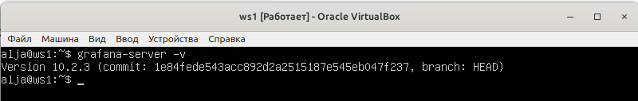
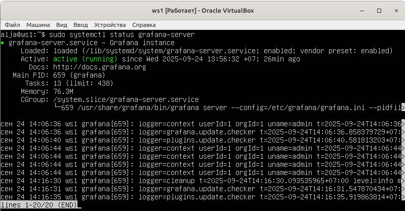
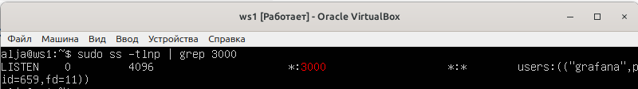
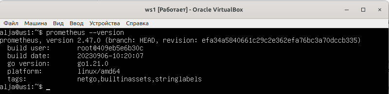
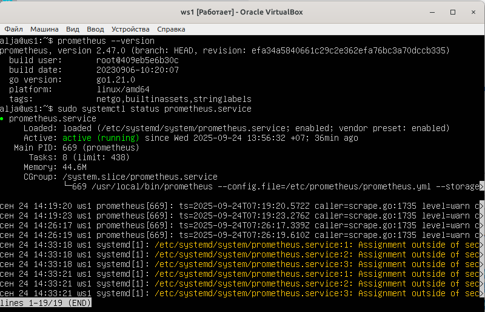
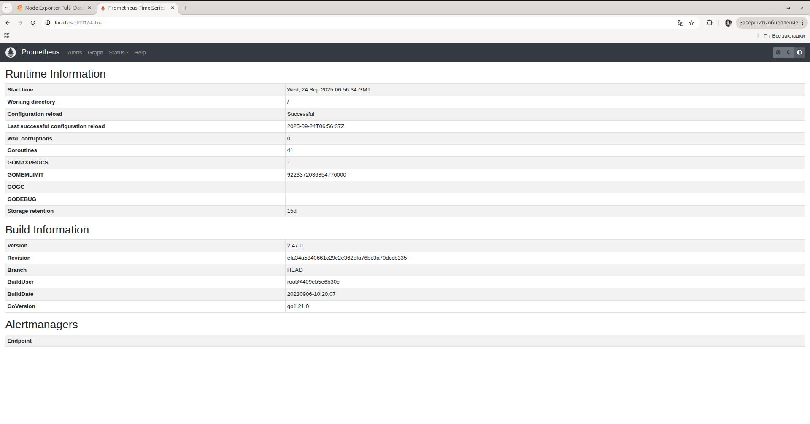
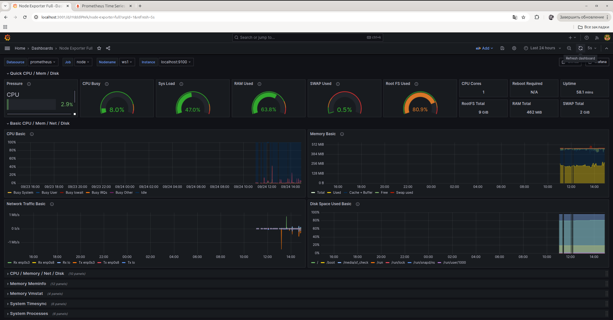
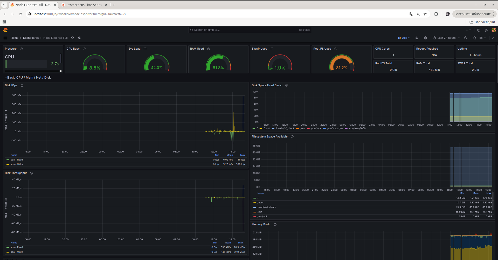
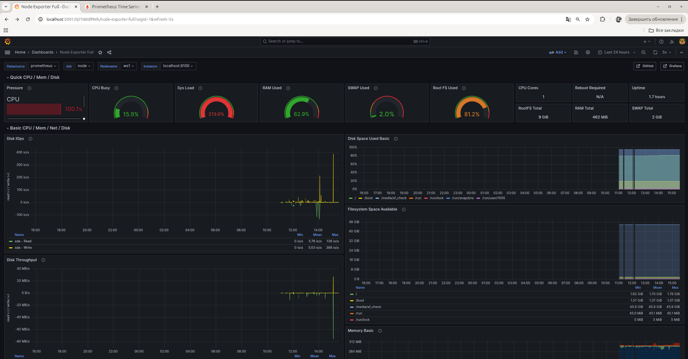

# Отчет по части 7. Прометей и Графана

## Prometheus и Grafana на виртуальной машине.
Проверяем версию Grafana на виртуальной машине (далее ВМ):
```bash
grafana-server -v
```


Проверяем статус Grafana:  
```bash
sudo systemctl status grafana-server
```


Проверяем, слушает ли порт 3000:  
```bash
sudo ss -tlnp | grep 3000
```


Проверяем версию Prometheus на виртуальной машине (далее ВМ):
```bash
prometheus --version
```


Проверяем статус Prometheus:  
```bash
sudo systemctl status prometheus
```


Проверяем, слушает ли порт 3000:  
```bash
sudo ss -tlnp | grep 3000
```


Grafana с локального ПК в браузере c панелю инструментов: отображение загрузки ЦП, доступная оперативная память, место на жестком диске:


Prometheus с локального ПК в браузере:


Запускаем скрипт из части 2 и наблюдаем, как изменились показатели в Grafana:
```bash
sudo ./main.sh az az.az 3Mb
```




> Метрики жесткого диска:
>- Root FS Used - % использованного места на основном жестком диске (где установлена система)
>- Disk I/O Operations - количество операций чтения/записи в секунду
>- Disk Throughput - объем данных, читаемых/записываемых в мегабайтах в секунду (пропускная спобоность)
>- Disk Space Usage - использование места по точкам монтирования
>- Filesystem Space Available - свободное место



Метрики после теста:
```bash
sudo stress -c 2 -i 1 -m 1 --vm-bytes 32M -t 10s

```



