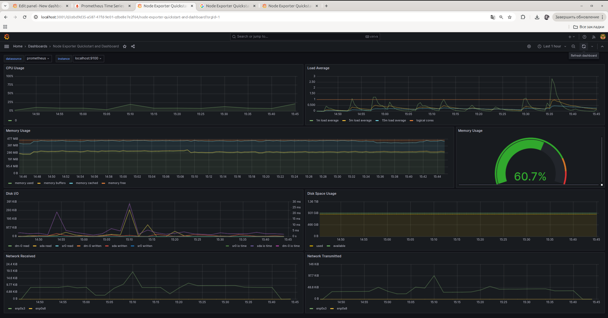
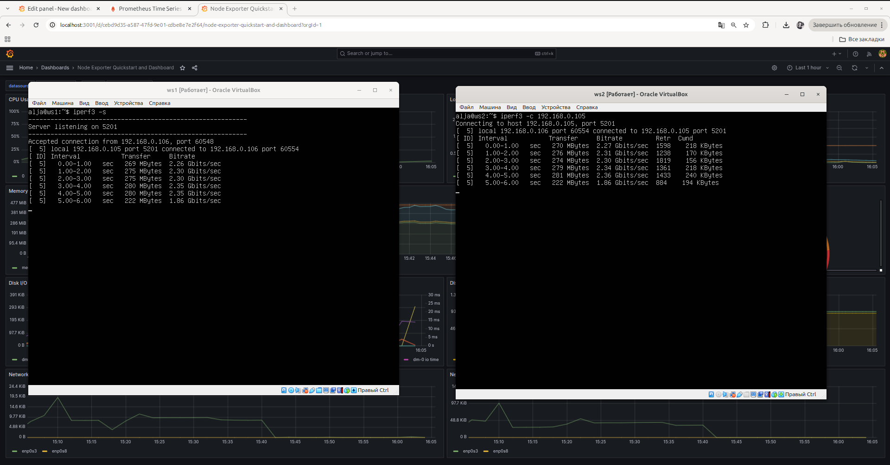
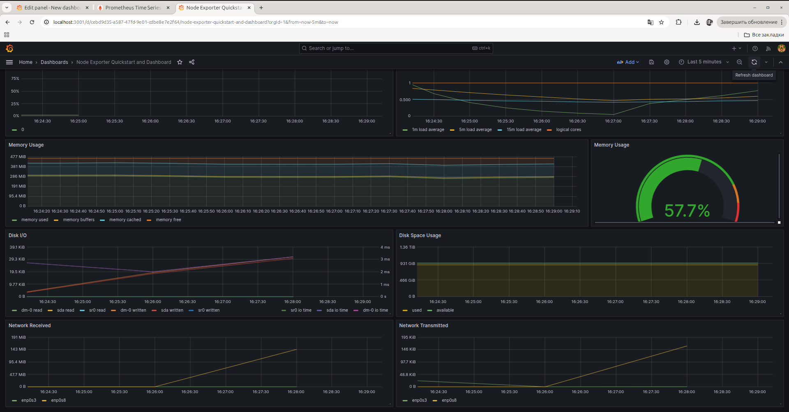

# Отчет по части 8. Прометей и Графана

Загрузили готовую панель инструментов Node Exporter Quickstart and Dashboard с официального сайта Grafana Labs и запустили тест:
```bash
sudo stress -c 2 -i 1 -m 1 --vm-bytes 32M -t 10s
```


Теперь запускаем еще одну виртуальную машину (ws2) в той же сети, что и текущая. И запусткаем тест сетевой нагрузки с помощью iperf3.
На ВМ 1 (сервер):
```bash
iperf3 -s
```

На ВМ 2 (клиент):
```bash
iperf3 -c 192.168.0.105
```



Смотрим показатели в Grafana:


