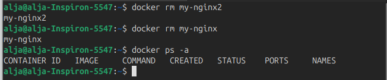
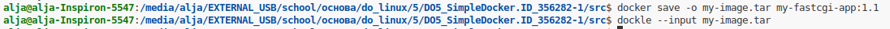
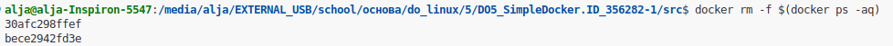

# Отчет по Simple Docker

## Навигация
- [Part 1: Готовый докер](#part-1-готовый-докер)
- [Part 2: Операции с контейнером](#part-2-операции-с-контейнером)
- [Part 3: Мини веб-сервер](#part-3-мини-веб-сервер)
- [Part 4: Свой докер](#part-4-свой-докер)
- [Part 5: Доккл](#part-5-доккл)
- [Part 6: Docker Compose](#part-6-базовый-docker-compose)

## Part 1. Готовый докер

- Берем официальный докер-образ с nginx и качем его при помощи docker pull. 

  1. Проверяем установку Docker:

      ```bash
      $ docker --version
      ```
      

      *команда для проверки версии Docker*


  2. Загружаем образ nginx с указанием тега (версии):

      ```bash
      $ sudo docker pull nginx:latest
      ```
      

      *команда для скачивания образа nginx*

- Проверяем наличие докер-образа через docker images:
    ```bash
      $ sudo docker images nginx
    ```

    

    *команда для проверки наличия докер-образа*

- Запускаем докер-образ через docker run -d [image_id|repository]:

      $ sudo docker run -d --name my-nginx -p 8080:80 nginx
      
    

  *команда для запуска докер-образа*

- Проверяем, что образ запустился через docker ps:

      $ sudo docker ps
      
    

    *команда для проверки запуска образа*

- Смотрим информацию о контейнере через docker inspect [container_id|container_name]:
  ```bash
  $ sudo docker inspect my-nginx
  ```
  

  *команда для проверки запуска образа и инофрмаци о контейнере (часть 1)*

  

  *инофрмаця о контейнере (часть 2)*

    

    *инофрмаця о контейнере (часть 3)*

    

    *инофрмаця о контейнере (часть 4)*

    

    *инофрмаця о контейнере (часть 5)*

    

    *инофрмаця о контейнере (часть 6)*

- По выводу команды определяем:
  1. размер контейнера == ~1.09 kB (57.06kB - 55.97kB) 
  2. список замапленных портов == Порт 80/tcp контейнера замаплен на порт 8080 хоста (доступен как 0.0.0.0:8080 и [::]:8080)
  3. ip контейнера == 172.17.0.2

  Размер контейнера определяем командой:
  ```bash
  $ sudo docker system df
  ```
  

  *инофрмаця о размере контейнеров*

- Останавливаем докер контейнер через docker stop [container_id|container_name]:

  Сначала добавим пользователя в группу docker и перезайдем:
  ```bash
  $ sudo usermod -aG docker $USER
  $ newgrp docker
  ```
  Останавливаем докер контейнер и проверяем его остановку:
  ```bash
  $ sudo docker stop my-nginx
  $ docker ps
  ```
    

  *остановили контейнейр и убедились, что остановлен (инфо нет)*

- Запускаем докер с портами 80 и 443 в контейнере, замапленными на такие же порты на локальной машине, через команду run:

  ```bash
  $ docker run -d --name my-nginx2 -p 80:80 -p 443:443 nginx
  ```
    

  *запустили докер с портами 80 и 443*

- Проверяем, что в браузере по адресу localhost:80 доступна стартовая страница nginx:
    

  *стартовая страница nginx в браузере localhost:80*

- Перезапускаем докер контейнер через docker restart [container_id|container_name]:
  ```bash
  $ docker restart my-nginx2
  ```
    

  *команда для перезапуска докер контейнера*

- Проверяем, что контейнер запустился:
  ```bash
  $ docker ps
  ```
    

  *команда для проверки запущенных контейнеров*

## Part 2. Операции с контейнером

- Читаем конфигурационный файл nginx.conf внутри докер контейнера через команду exec:
  ```bash
  $ docker exec my-nginx2 cat /etc/nginx/nginx.conf
  ```
    

  *команда для чтения nginx.conf внутри докер контейнера*

- Создаем на локальной машине файл nginx.conf:
  ```bash
  $ nano nginx.conf
  ```
    
  
  *создание файла с помощью редактора nano*

- Настраиваем в нем по пути /status отдачу страницы статуса сервера nginx:

    
  
  *настройки nginx*

- Копируем созданный файл nginx.conf внутрь докер-образа через команду docker cp:
  ```bash
  $ docker cp nginx.conf my-nginx2:/etc/nginx/nginx.conf
  ```

    
  
  *копирование файла внутрь докер-образа*

- Перезапускаем nginx внутри докер-образа через команду exec:
  А прежде, проверим синтаксис конфига:
  ```bash
  $ docker exec my-nginx2 nginx -t
  ```
    
  
  *проверка синтаксиса конфига*

  Теперь перезапускаем внутри контейнера:
  ```bash
  $ docker exec my-nginx2 nginx -s reload
  ```
    
  
  *команда для перезапуска внутри контейнера*

- Проверяем, что по адресу localhost:80/status отдается страничка со статусом сервера nginx:

    
  
  *страничка в браузере со статусом nginx*

- Экспортируем контейнер в файл container.tar через команду export и проверим, что файл создался:
  ```bash
  $ docker export my-nginx2 > container.tar
  ```
    
  
  *команда для экспорта контейнера и проверка созданного файла*

- Останавливаем контейнер и проверяем статус:
  ```bash
  $ docker stop my-nginx2
  $ docker ps -a
  ```
  
  
  *остановили и проверили статус*

- Удаляем изображение, docker rmi [image_id|repository]не удаляя предварительно контейнер:
  Удаление образа выдает ошибку, т.к. уже используется в контейнерах.

- Удаляем остановленный контейнер и проверяем статус:

  ```bash
  $ docker rm my-nginx2
  $ docker rm my-nginx
  $ docker ps -a
  ```
  

  *команды для удаления контейнера и проверки статуса*

- Импортируйте контейнер обратно с помощью команды import и проверяем, что контейнер импортировался:
  ```bash
  $ docker import container.tar my-nginx-imported:latest
  $ docker images
  ```

  
  
  *импорт контейра и проверка импорта*

- Запусткаем импортированный контейнер и проверим его статус:
  ```bash
  $ docker run -d --name my-nginx-restored -p 80:80 my-nginx-imported /usr/sbin/nginx -g "daemon off;"
  ```

  
  
  *запустили контейнер и проверили статус*

- Убеждаемся, что localhost:80/status возвращает страницу состояния сервера nginx:

  
  
  *страница состояния nginx в браузере*

  
  
  *команда для остановки*


## Part 3. Мини веб-сервер

- Пишем мини-сервер на C и FastCgi, который будет возвращать простейшую страничку с надписью Hello, World! и устанавливаем необходимые пакеты:
  ```bash
  $ sudo apt update
  $ sudo apt install build-essential fcgiwrap spawn-fcgi libfcgi-dev
  ```

  
  
  *установка необходимых пакетов*

  Компилируем сервер:
  ```
  gcc -o fcgi_server server.c -lfcgi
  ```
  
  
  *команда для компиляции*

- Запускаем написанный мини-сервер через spawn-fcgi на порту 8080:

  ```
  spawn-fcgi -p 8080 -n ./fcgi_server
  ```

  
  
  *запуск мини-сервера*

  Проверяем, что процесс запущен:
  ```
  ps aux | grep fcgi_server
  ```

  Проверяем, слушает ли порт 8080
  netstat -tulpn | grep 8080

  
  
  *проверяем, что мини-сервер запущен и порт*

- Напишем свой nginx.conf, который будет проксировать все запросы с 81 порта на 127.0.0.1:8080:

  
  
  *конфиг nginx с проксированием*

- Запусткаем локально nginx с написанной конфигурацией, но для начала устанавливаем nginx (если не установлен):
  ```
  $ sudo apt update
  $ sudo apt install nginx
  ```
  
  
  *устанавливаем nginx*

  Запусткаем локально nginx с написанной конфигурацией:
  ```
  $ sudo nginx -c $(pwd)/nginx.conf
  ```
  
  
  *запускаем nginx с нашей конфигурацией*

- Проверяем, что в браузере по localhost:81 отдается написанная страничка:
  
  
  
  *страничка в браузере с нашим конфигом*

- Перемещаем файл nginx.conf по пути ./nginx/nginx.conf. Для начала создаем папку, затем перемещаем конфиг и проверяем:
  
  
  *переместили файл nginx.conf*

# Part 4. Свой докер
Написали свой докер-образ и теперь:
- Собираем написанный докер-образ через docker build при этом указав имя и тег:
  ```
  $ docker build -t my-fastcgi-app:1.0 .
  ```
  
  
  *собрали докер-образ*

- Проверяем через docker images, что все собралось корректно:
  ```
  $ docker images
  ```
  
  
  *собрали докер-образ*

- Запускаем собранный докер-образ с маппингом 81 порта на 80 на локальной машине и маппингом папки ./nginx внутрь контейнера по адресу, где лежат конфигурационные файлы nginx'а:
  ```
  $ docker run -d --name my-fastcgi -p 81:81 my-fastcgi-app:1.0
  ```
  
  
  *Запустили собранный докер-образ с маппингом 81 порта на 80*

- Проверяем, что по localhost:80 доступна страничка написанного мини сервера:

  
  
  *проверяем доступность странички через curl*


- Дописываем в ./nginx/nginx.conf проксирование странички /status, по которой надо отдавать статус сервера nginx:


- Пересобераем докер-образ:
  ```
  $ docker build -t my-fastcgi-app:1.0 .
  ```
  
  
  *пересобрали докер-образ*

  проверяем, что образ пересобрался:

  
  
  *проверили пересборку докер-образа*

  Перед запуском, останавливаем и удаляем старый контейнер и запускам новый:
  ```
  $ docker stop fastcgi-test
  $ docker rm fastcgi-test
  $ docker run -d --name fastcgi-test -p 80:81 my-fastcgi-app:1.0
  ```
  
  
  *остановили и удалили старый контейнер и запустили новый*

-  Проверяем, что по localhost:80 доступна страничка написанного мини сервера:
  
  
  *страничка написанного мини сервера в браузере*

- Дополнили в ./nginx/nginx.conf проксирование странички /status, по которой надо отдавать статус сервера nginx:
  
  
  *Дополнили в ./nginx/nginx.conf проксирование странички /status*

- Пересобираем докер-образ:
  ```
  $ docker stop fastcgi-test
  $ docker rm fastcgi-test
  $ docker run -d --name fastcgi-test -p 80:81 my-fastcgi-app:1.0
  ```
  Оказалось, что 80 порт занят, проверяем что занимает:
  ```
  sudo lsof -i :80
  ```

  Останавливаем nginx:
  ```
  sudo systemctl stop nginx
  ```

  Проверяем что порт свободен:
  ```
  sudo netstat -tulpn | grep :80
  ```

  Запускаем контейнер:
  ```
  docker run -d --name fastcgi-test -p 80:81 my-fastcgi-app:1.0
  ```

  Проверяем работает ли теперь localhost:80:
  ```
  curl http://localhost/status
  ```
  
  
  *Пересобрали образ Docker, чтобы localhost:80/status возвращал страницу со статусом nginx*

# Part 5. Доккл

- Проверяем образ из предыдущего задания с помощью dockle [image_id|repository].
  Для начала, устанавиливаем:

  
  
  *скачали, установили и проверили версию*

  Проверяем образ с помощью Dockle:
  ```
  dockle my-fastcgi-app:1.0
  ```

  
  
  *Ошибка при проврке dockle*

  Вышла ошибка. Сохраняем образ в архив, чтобы проверить из архива и отдаем Dockle архивированный образ:
  ```
  docker save my-fastcgi-app:1.0 -o my-image.tar
  dockle --input my-image.tar
  ```

  
  
  *заархивировали образ, запустили dockle и результат проверки*

  Ошибки и поедупреждения:
  1. CIS-DI-0010: Do not store credential in environment variables/files
  Критическая ошибка в базовом образе nginx:alpine. Dockle считает это "учетными данными", которые не должны храниться в образе. 

  + Мы будем игнорировать эту проблему:
  ```
  dockle --accept-key CIS-DI-0010 my-fastcgi-app:1.0
  ```
  2. CIS-DI-0005: Enable Content trust for Docker
  Рекомендует использовать Docker Content Trust для проверки подлинности образов. Это механизм цифровой подписи образов.

  + Перед сборкой:
  ```
  export DOCKER_CONTENT_TRUST=1
  ```

  3. CIS-DI-0001: Create a user for the container
  Контейнер запускается от root. Повышает риски безопасности.

  + Добавим в dockerfile создние нового пользователя (не root): 
  ```
  RUN adduser -D -u 1000 appuser
  USER appuser
  ```

  4. CIS-DI-0006: Add HEALTHCHECK instruction
  отсутствует проверка работоспособности (здоровья) контейнера

  + Добавим в dockerfile HEALTHCHECK:
  ```
  HEALTHCHECK --interval=30s --timeout=10s --start-period=10s --retries=3 \
      CMD curl -f http://localhost:81/ || exit 1
  ```

  Исправили dockerfile и запускаем снова dockle. Для начала:

+ Активируем Content Trust (CIS-DI-0005) перед сборкой:
  ```
  export DOCKER_CONTENT_TRUST=1
  ```
+ Собираем образ с новым тегом:
  ```
  sudo docker build -t my-fastcgi-app:1.1 .
  ```
  
  
  *собрали образ*

+ Запускаем контейнер для тестирования
  ```
  docker run -d --name test-app -p 80:81 my-fastcgi-app:1.1
  ```

  
  *запустили контейнер*

+ Проверяем healthcheck:
  ```
  docker inspect --format='{{.State.Health.Status}}' test-app
  ```
  
  
  *Проверили healthcheck и порт 80*

+ Выгружаем образ в .tar и запускаем dockle:
  ```
  docker save -o my-image.tar my-fastcgi-app:1.1
  dockle --input my-image.tar
  ```

  
  
  *выгрузили в архив и запустили проверку dockle*

# Part 6. Базовый Docker Compose

+ Создаем docker-compose.yml и nginx-proxy.conf и остановим все запущенные контейнеры:
  ```
  docker stop $(docker ps -aq)
  ```

  
  
  *остановили все запущенные контейнеры*

+ Собераем проект:
  ```
  docker-compose build
  ```
  
  
  *собрали проект*

+ Запускаем проект:
  ```
  docker-compose up -d
  ```

  
  
  *запустили проект*

+ Проверяем, что браузер возвращает страницу, которую вы написали на localhost:80:

  
  
  *страница localhost:80 в браузере*


